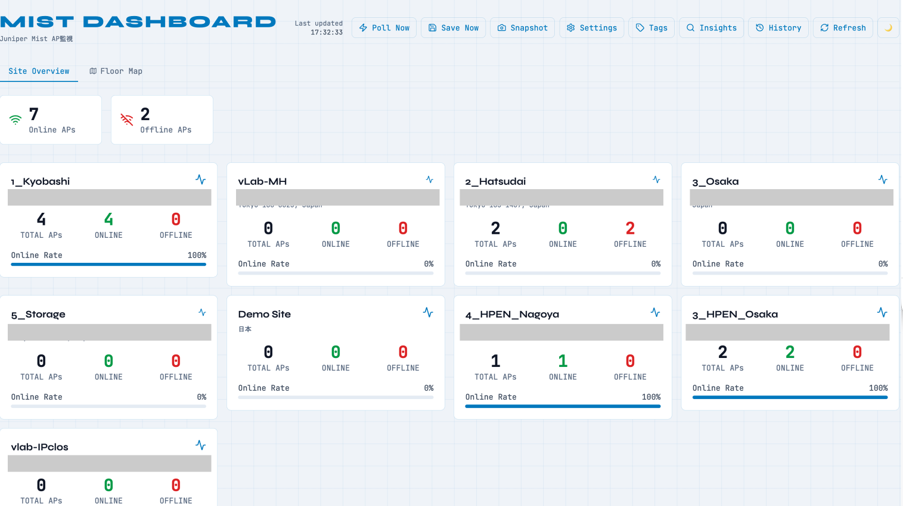
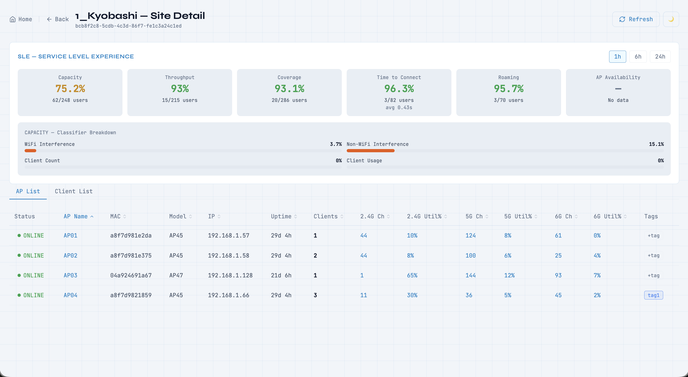
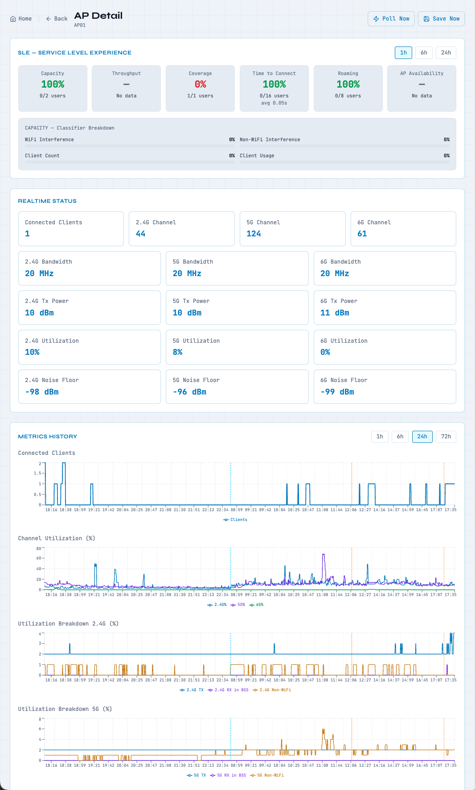
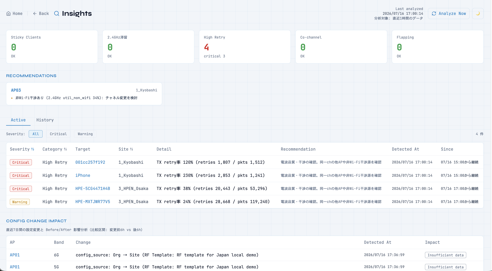
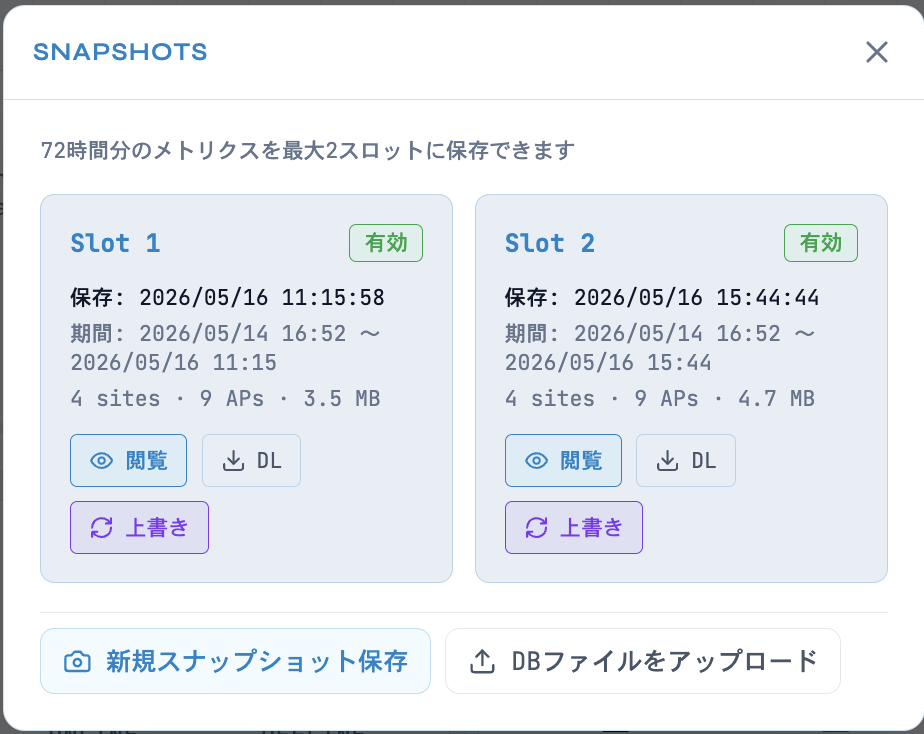
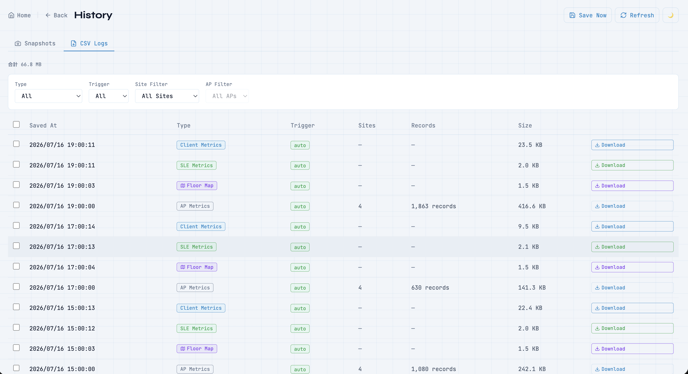
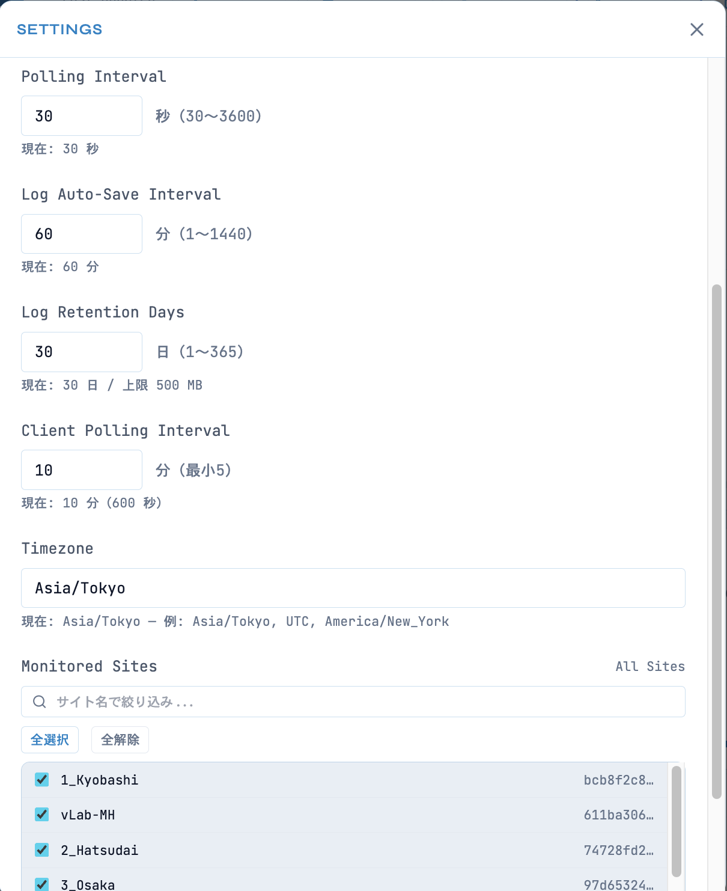

# mist-rf-dashboard

A real-time monitoring and troubleshooting dashboard for Juniper Mist wireless networks.
Visualize AP metrics, radio configurations, client experience (SLE), and automatically detect
Wi-Fi issues across all sites.



## Features

### Monitoring
- **Site Overview**: All sites with AP online/offline status and online rate at a glance
- **Site Detail**: SLE summary + sortable AP List and Client List, tabbed per site
- **AP Detail**: Time-series graphs (1h/6h/24h/72h, plus an optional 30-day view) for connected
  clients, channel utilization
  (total, TX, RX in BSS, Non-WiFi per band), noise floor, Tx power, channel, and bandwidth
- **Client List / Client Detail**: Per-client RSSI, SNR, TX/RX rate, throughput, band/channel
  history with roaming markers
- **Floor Map**: Interactive floor plan with AP overlay, channel-based color coding, and
  co-channel interference summary per band



### Client Experience (SLE)
- Capacity / Throughput / Coverage / Time to Connect / Roaming / AP Availability, at both the
  site level and per-AP level
- Capacity classifier breakdown (Wi-Fi interference, non-Wi-Fi interference, client count,
  client usage) to pinpoint *why* a score is low

### Radio Configuration
- Configuration hierarchy detection per band: Org / Site (RF Template) / Device Profile / Device
- Automatic change detection and history (channel, bandwidth, Tx power, enable/disable)



### Insights — Automated Issue Detection
- **Sticky Client**: clients staying on a weak-signal AP instead of roaming
- **2.4GHz stuck**: dual-band clients stuck on 2.4GHz (band steering failure)
- **High Retry**: abnormal TX retry rate per client
- **Co-channel interference**: AP pairs on the same channel with high mutual interference
- **Roaming flapping**: clients bouncing between APs too frequently
- **Config Change Impact**: automatic before/after comparison (SLE, utilization, retry rate)
  around every radio configuration change, with an Improved / Degraded / Neutral verdict
- **Recommendations**: rule-based optimization suggestions per AP (e.g. free channel
  suggestions for co-channel conflicts)
- Active / History view — issues are tracked from first detection to resolution, not just a
  point-in-time snapshot



### Operations
- **Tags**: attach free-form tags to APs and clients, and filter a dedicated view by tag
- **Snapshot**: freeze and replay a full 72-hour metrics window at any point in time — save up
  to 2 slots, then download/upload `.db` files to review the exact same graphs offline or on a
  different machine, even after the live data has rolled off
- **CSV Export**: automatic hourly export (AP metrics, SLE metrics, client metrics, floor map
  summary) with manual "Save Now", searchable/filterable History page
- **Multi-Environment**: register multiple Mist orgs (e.g. per customer/site) and switch between
  them from the GUI — no container restart required
- **Settings (GUI)**: API credentials, region, polling interval, log retention, timezone, and
  monitored-site filtering, all configurable via the browser
- **Dark/Light Mode** and full timezone support for all timestamps





## Requirements

- Docker & Docker Compose
- Juniper Mist account with API token

## Setup

1. Clone the repository:
   ```bash
   git clone git@github.com:kshimonoj/mist-rf-dashboard.git
   cd mist-rf-dashboard
   ```

2. Start the application:
   ```bash
   docker compose up -d
   ```

3. Open `http://localhost:3007` in your browser.

4. Configure your credentials in the Settings page (see [Settings (GUI)](#settings-gui) below).

### Optional: Configure via .env

If you prefer to set credentials via environment variables instead of the GUI:

```bash
cp .env.example .env
```

Edit `.env` with your Mist credentials:
```
MIST_API_TOKEN=your_api_token
MIST_ORG_ID=your_org_id
MIST_BASE_URL=https://api.mist.com/api/v1
POLLING_INTERVAL_SECONDS=300
TIMEZONE=Asia/Tokyo
API_URL=http://localhost:8008
CORS_ORIGINS=http://localhost:3007
```

> **Note**: `.env` values are seeded into the database on first startup. After that, the GUI
> takes precedence. Use `docker compose down && docker compose up -d` (not `restart`) to reload
> `.env`.

> **Note**: `API_URL` is the backend URL as seen from the browser:
> - Local machine: `http://localhost:8008`
> - Remote server: `http://<SERVER_IP>:8008`

> **Note**: `CORS_ORIGINS` is a comma-separated list of allowed origins. Add your server's IP if
> accessing from a remote browser (e.g. `http://localhost:3007,http://192.168.1.100:3007`).

## Settings (GUI)

Open the Settings panel from the **Settings** button in the header.



### Environments (multi-org support)

Register one or more Mist environments (org + token + region) and switch the active one at any
time. Switching clears the locally cached metrics/insights for a clean start in the new
environment; tags are preserved across environments.

### API Credentials

| Field | Description |
|-------|-------------|
| API Token | Your Mist API token. Leave blank to keep the existing token. |
| Org ID | Your Mist organization ID (UUID format). |
| Region | Select the Mist region that matches your organization's location. |

Changes take effect on the **next polling cycle** without requiring a restart.

#### Finding Your Region

The region can be identified from the URL in the Mist portal:

| Portal URL | Region |
|------------|--------|
| `manage.mist.com` | Global 01 |
| `manage.gc1.mist.com` | Global 02 (GC1) |
| `manage.ac2.mist.com` | Global 03 / APAC (AC2) |
| `manage.eu.mist.com` | EMEA 01 (EU) |

For the full list of regions, refer to the official documentation:
[Juniper Mist API Endpoint URLs and Global Regions](https://www.juniper.net/documentation/jp/ja/software/mist/automation-integration/topics/topic-map/api-endpoint-url-global-regions.html)

### Other Settings

| Setting | Description |
|---------|-------------|
| Polling Interval | How often to fetch AP data from the Mist API (30–3600 seconds) |
| Client Polling Interval | How often to fetch the client list (minimum 5 minutes) |
| Log Auto-Save Interval | How often to auto-save CSV logs (1–1440 minutes) |
| Log Retention Days | How long to keep CSV log files (1–365 days) |
| **30-Day Metrics History** | Off by default. When enabled, adds a `30d` option to the SLE and AP Detail graph selectors, and extends the local metrics retention (see below) |
| Timezone | Timezone for all timestamps (e.g. `Asia/Tokyo`, `UTC`) |
| Monitored Sites | Filter which sites to display and collect data for |

### Metrics Retention & 30-Day History

The raw AP/client metrics stored in `mist.db` are **not** covered by "Log Retention Days" (that
setting only applies to exported CSV files). By default, raw metrics are pruned nightly
(03:00) after **7 days** to keep the database small.

Enabling **30-Day Metrics History** in Settings does two things:

1. Raises local metrics retention to 30 days (nightly prune keeps the last 30 days instead of 7)
2. Unlocks a `30d` button next to `1h / 6h / 24h / 72h` on:
   - the SLE cards (Site Detail and AP Detail) — queried live from the Mist API, no local
     storage impact
   - AP Detail's METRICS HISTORY graphs — queried from the local database. To keep 30-day
     graphs fast, this view is automatically returned as **hourly averages** instead of raw
     samples (channel/bandwidth show the latest value per hour instead of an average)

> **Note**: Turning this on increases database size, especially with many APs and a short
> polling interval. A confirmation dialog is shown before enabling it. Turning it back off
> shrinks retention to 7 days again on the next nightly prune — export any CSV logs you want to
> keep before switching back.

## Switching Environments (Mist org)

You can switch to a different Mist organization directly from the Settings GUI (Environments
section) — no restart needed. Alternatively, edit `.env` and reload:

```bash
docker compose down
docker compose up -d
```

> **Important**: `docker compose restart` does NOT reload `.env`. Always use `down` + `up`.

## Ports

| Service | Host Port | Container Port |
|---------|-----------|----------------|
| Frontend (Next.js) | 3007 | 3000 |
| Backend (FastAPI) | 8008 | 8000 |

## Hang AP Detection (offline log analysis)

`backend/hangap/` analyses exported Mist logs offline (no network access, no LLM calls):

- `hangap.loader.load()` merges the split CSV / XLSX log files, normalises them, and reports
  duplicates and **gaps** (missing sampling periods).
- `hangap.detector.detect()` finds zero-client intervals — an AP that stays `connected` while
  its client count sits at zero — and correlates AP events (±30 min by default) around the end
  of each interval.

```python
from hangap import detect, load

res = load("/path/to/logs/2026-08-09")
df = detect(res.metrics, res.events, res.gaps,
            window_start="2026-08-09 16:00", window_end="2026-08-09 22:00")
```

Always pass `gaps`. Without it, a zero interval is silently joined across a missing period and
the zero-sample count becomes too large — it never raises an error, so the mistake is hard to
notice.

### `min_zero_samples` counts samples, not time

**The sampling interval differs per environment** (measured: 30 s in the demo environment,
5 min at customer sites). The default `min_zero_samples=5` therefore means 25 minutes at a
5-minute interval but only **2.5 minutes** at a 30-second interval. When the interval is
unknown or mixed, use `min_zero_duration` (a time span) instead — it takes precedence over
`min_zero_samples`. `hangap.loader` reports the estimated interval per AP, so check it first.

Ongoing intervals (`継続中`) and site-wide exodus candidates (`退場疑い=True`) are kept in the
result on purpose; filtering is left to the caller.

## Data Persistence

All data is stored in the `./data/` directory:
```
data/
├── mist.db          # SQLite database (metrics, settings, credentials, tags, insights)
├── logs/             # Auto-saved CSV logs (AP / SLE / client metrics, floor map summary)
└── snapshots/        # Snapshot database files (max 2 slots)
```

## Security Notes

- `.env` is excluded from git via `.gitignore` — **do not commit it**
- `data/` (SQLite database) is also excluded — **do not commit it**
- **Never** write your API token or Org ID directly in code or README files
- API tokens stored in the database are masked (`abcd****`) in the GUI and API responses
- `mist_base_url` is restricted to `*.mist.com` to prevent SSRF / token exfiltration
- Use environment-specific `.env` files (e.g. `.env.prod`) and keep them local

### Protecting the Credentials API

The `POST /api/credentials` endpoint modifies stored Mist API tokens. If your backend port
(8008) is reachable by untrusted clients, set `SETTINGS_SECRET` in `.env`:

```env
SETTINGS_SECRET=your_random_secret_here  # openssl rand -hex 32
```

When set, the endpoint requires an `X-Settings-Key: <secret>` header. The GUI will prompt for
the Admin Key automatically. If `SETTINGS_SECRET` is empty, the endpoint is open — acceptable
for localhost-only deployments.

## Troubleshooting

### Settings > ENVIRONMENTS shows "Loading..." forever

If you are accessing the dashboard from a different machine (e.g. `http://192.168.x.x:3007`),
add your server's IP to `CORS_ORIGINS` in `.env`:

```
CORS_ORIGINS=http://localhost:3007,http://192.168.x.x:3007
```

Then restart the backend container:
```bash
docker compose restart backend
```

### After `git pull`, the backend fails with `no such column: ...`

A new release added columns to an existing table. Run the migration manually:

```bash
docker compose exec backend python3 -c "from database import migrate_db; migrate_db(); print('done')"
```

If the container was not running yet, start it first, then run the command above.

## Mist API Reference

This dashboard is built entirely on the Juniper Mist REST API. For reference, here are the
endpoints in use:

### Org / Site
| Endpoint | Purpose |
|---|---|
| `GET /orgs/{org_id}/sites` | List sites |
| `GET /orgs/{org_id}/rftemplates` | RF Templates (for radio config hierarchy detection) |
| `GET /orgs/{org_id}/deviceprofiles` | Device Profiles (for radio config hierarchy detection) |
| `GET /sites/{site_id}/setting` | Site settings (RF Template assignment) |

### Access Points
| Endpoint | Purpose |
|---|---|
| `GET /sites/{site_id}/devices?type=ap&limit=1000` | Bulk AP configuration (paginated via `X-Page-Total`) |
| `GET /sites/{site_id}/devices/{ap_id}` | Single AP configuration detail |
| `GET /sites/{site_id}/stats/devices?type=ap` | AP real-time stats (channel, utilization, noise floor, etc.) |
| `GET /sites/{site_id}/devices/events/search?duration=` | AP events (reboot, DFS, etc.) |

### Clients
| Endpoint | Purpose |
|---|---|
| `GET /sites/{site_id}/stats/clients` | Currently connected clients with real-time RSSI/SNR/rates. **Note**: `limit` and `ap_mac` query parameters are documented but do not filter/paginate in practice — the endpoint always returns the full site-wide list. |
| `GET /sites/{site_id}/clients/search` | Historical client connection search. `limit` and `ap_mac` filtering work correctly here, but RSSI/SNR/rate fields are not included. |

### SLE (Service Level Experience)
| Endpoint | Purpose |
|---|---|
| `GET /sites/{site_id}/sle/site/{site_id}/metric/{metric}/summary?duration=` | Site-level SLE (capacity, throughput, coverage, time-to-connect, roaming, ap-availability) |
| `GET /sites/{site_id}/sle/ap/{ap_id}/metric/{metric}/summary?duration=` | AP-level SLE (same 6 metrics) |
| `GET /sites/{site_id}/sle/site/{site_id}/metric/{metric}/classifier/{classifier}/summary?duration=` | Classifier breakdown (e.g. wifi-interference, non-wifi-interference for the capacity metric) |

> All endpoints are called with `Authorization: Token <api_token>`. See the [official Mist API
> reference](https://www.juniper.net/documentation/us/en/software/mist/api/http/api/introduction)
> for full parameter documentation.

## Tech Stack

- **Frontend**: Next.js 14, TypeScript, Tailwind CSS, Recharts, SWR
- **Backend**: FastAPI, SQLAlchemy, APScheduler, httpx
- **Database**: SQLite
- **Infrastructure**: Docker Compose

## License

MIT License. See [LICENSE](LICENSE) for details.
